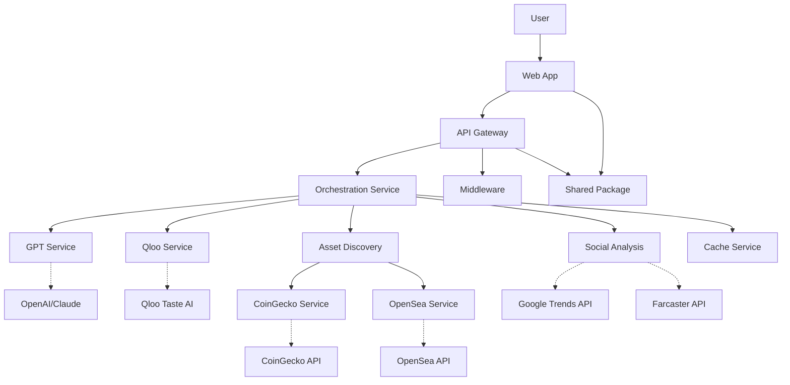

# Cultural Arbitrage Signal Engine

A web3 trend intelligence platform that maps cultural "vibes" to crypto/NFT opportunities, providing real-time insights for strategic investments in the digital culture economy.

## 🚀 Project Overview

The Cultural Arbitrage Signal Engine is designed to:

- **Trend Detection**: Monitor cultural shifts across social platforms, art communities, and digital spaces
- **Signal Analysis**: Process cultural data to identify emerging opportunities in crypto/NFT markets
- **Intelligence Dashboard**: Provide actionable insights through an intuitive web interface
- **API Integration**: Offer programmatic access to trend intelligence data

## 🏗️ Architecture

### System Overview



The Cultural Arbitrage Signal Engine transforms cultural "vibes" into actionable crypto/NFT insights through a sophisticated pipeline that combines AI-powered analysis, taste correlations, and multi-source asset discovery.

### Technical Stack

This is a **monorepo** built with:

- **Turborepo**: For efficient build orchestration and caching
- **TypeScript**: End-to-end type safety
- **Modern Tooling**: ESLint, Prettier, and automated workflows

### Apps

- **`apps/web`**: Next.js 14 frontend with React, TailwindCSS, and shadcn/ui
- **`apps/api`**: Node.js/Express backend with TypeScript

### Packages

- **`packages/shared`**: Common types, utilities, and configurations

## 🛠️ Getting Started

### Prerequisites

- **Node.js**: >= 18.17.0
- **npm**: >= 9.6.5

### Installation

1. **Clone the repository**

   ```bash
   git clone https://github.com/anythingai/CASEngine.git
   cd cultural-arbitrage
   ```

2. **Install dependencies**

   ```bash
   npm install
   ```

3. **Set up environment variables**

   ```bash
   # Copy environment examples
   cp apps/web/.env.local.example apps/web/.env.local
   cp apps/api/.env.example apps/api/.env
   
   # Edit the files with your configuration
   ```

### Development

Start all applications in development mode:

```bash
npm run dev
```

This will start:

- **Web app**: <http://localhost:3000>
- **API server**: <http://localhost:8000>

### Individual App Development

You can also run apps individually:

```bash
# Web app only
cd apps/web && npm run dev

# API server only
cd apps/api && npm run dev
```

## 📦 Scripts

| Command | Description |
|---------|-------------|
| `npm run dev` | Start all apps in development mode |
| `npm run build` | Build all apps for production |
| `npm run start` | Start all apps in production mode |
| `npm run lint` | Run linting across all packages |
| `npm run type-check` | Run TypeScript type checking |
| `npm run test` | Run tests across all packages |
| `npm run clean` | Clean build artifacts |
| `npm run format` | Format code with Prettier |

## 🔧 Configuration

### Environment Variables

Each app has its own environment configuration:

- **Web App** (`apps/web/.env.local`): Frontend configuration
- **API Server** (`apps/api/.env`): Backend configuration and API keys

### Turborepo

Build configuration is managed in [`turbo.json`](./turbo.json). This defines:

- Build dependencies and order
- Caching strategies
- Development and production pipelines

## 🚀 Deployment

### Production Build

```bash
npm run build
```

### Starting Production

```bash
npm run start
```

The build process will:

1. Build shared packages first
2. Build and optimize the web frontend
3. Build and prepare the API server
4. Generate optimized production bundles

## 🧪 Testing

Run the test suite:

```bash
npm run test
```

Tests are organized by package:

- Unit tests for shared utilities
- Integration tests for API endpoints
- Component tests for frontend

## 📁 Project Structure

``` text
cultural-arbitrage/
├── apps/
│   ├── web/                 # Next.js frontend
│   └── api/                 # Node.js/Express backend
├── packages/
│   └── shared/              # Shared types and utilities
├── .github/
│   └── workflows/           # CI/CD pipelines
├── turbo.json              # Turborepo configuration
├── package.json            # Root workspace configuration
└── README.md               # This file
```

## 🤝 Contributing

1. **Fork** the repository
2. **Create** a feature branch (`git checkout -b feature/amazing-feature`)
3. **Commit** your changes (`git commit -m 'Add amazing feature'`)
4. **Push** to the branch (`git push origin feature/amazing-feature`)
5. **Open** a Pull Request

### Development Workflow

- Follow the existing code style and patterns
- Write tests for new functionality
- Update documentation as needed
- Ensure all CI checks pass

## 📄 License

This project is licensed under the **MIT License** - see the [LICENSE](LICENSE) file for details.

## 🔗 Links

- **Documentation**: [Coming Soon]
- **API Reference**: [Coming Soon]
- **Issues**: [GitHub Issues](https://github.com/anythingai/CASEngine/issues)
- **Discussions**: [GitHub Discussions](https://github.com/anythingai/CASEngine/discussions)

---

**Built with ❤️ for the Web3 Community**
