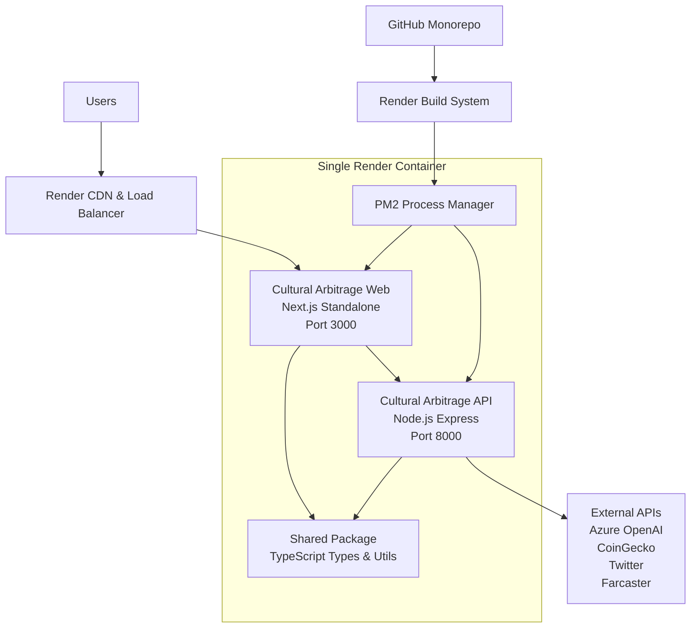

# 🚀 **Render Monorepo Deployment Guide**

Deploy your **entire Cultural Arbitrage monorepo** as a single service on Render with both API and Web running together.

## 🎯 **Quick Start**

```bash
# 1. Generate secrets
openssl rand -hex 32  # Use for JWT_SECRET
openssl rand -hex 24  # Use for API_KEY

# 2. Push to GitHub
git add .
git commit -m "Ready for Render monorepo deployment"
git push origin main

# 3. Deploy to Render (see detailed steps below)
```

---

## 📋 **Prerequisites**

- GitHub repository with your code
- Render account ([render.com](https://render.com))
- Your API keys ready (Azure OpenAI, CoinGecko, Twitter, etc.)

---

## 🔧 **Files Created for Render**

Your monorepo is now configured with these Render-specific files:

- **[`Dockerfile.render`](Dockerfile.render:1)** - Single container for both API and Web
- **[`ecosystem.render.js`](ecosystem.render.js:1)** - PM2 configuration for process management
- **[`render.yaml`](render.yaml:1)** - Infrastructure as Code (optional)
- **[`.env.render`](.env.render:1)** - Environment variables template
- **This guide** - Complete deployment instructions

---

## 🌐 **Step-by-Step Deployment**

### **Step 1: Create Render Service**

1. **Go to [render.com](https://render.com)** and login
2. **Click "New +"** → **"Web Service"**
3. **Connect your GitHub repository**
4. **Configure the service:**

```yaml
# Service Configuration:
Name: cultural-arbitrage
Environment: Docker
Dockerfile Path: ./Dockerfile.render
Branch: main
Region: Oregon (or your preferred region)
```

### **Step 2: Configure Environment Variables**

In your Render service dashboard, go to **Environment** tab and add these variables:

#### **Core Settings:**

```bash
NODE_ENV=production
PORT=3000
HOSTNAME=0.0.0.0
NEXT_PUBLIC_API_URL=http://localhost:8000
```

#### **Security (Generate Strong Values!):**

```bash
# Generate with: openssl rand -hex 32
JWT_SECRET=your-32-character-secret-here

# Generate with: openssl rand -hex 24
API_KEY=your-24-character-secret-here
```

#### **Your API Keys:**

```bash
AZURE_OPENAI_API_KEY=your-azure-openai-key
AZURE_OPENAI_ENDPOINT=https://your-resource.openai.azure.com/
AZURE_OPENAI_DEPLOYMENT=o4-mini
AZURE_OPENAI_API_VERSION=2025-01-01-preview

COINGECKO_API_KEY=your-coingecko-key
OPENSEA_API_KEY=your-opensea-key

TWITTER_API_KEY=your-twitter-key
TWITTER_API_SECRET=your-twitter-secret
TWITTER_BEARER_TOKEN=your-twitter-bearer
TWITTER_ACCESS_TOKEN=your-twitter-access
TWITTER_ACCESS_TOKEN_SECRET=your-twitter-secret

FARCASTER_API_KEY=your-farcaster-key
```

#### **Performance Settings:**

```bash
LOG_LEVEL=info
CACHE_TTL_SHORT=300
CACHE_TTL_MEDIUM=1800
CACHE_TTL_LONG=3600
RATE_LIMIT_MAX_REQUESTS=1000
ENABLE_RATE_LIMITING=true
ENABLE_LOGGING=true
ENABLE_CORS=true
ENABLE_COMPRESSION=true
```

#### **App Configuration:**

```bash
NEXT_PUBLIC_APP_NAME=Cultural Arbitrage Signal Engine
NEXT_PUBLIC_APP_TAGLINE=Trade the trend before it trends — with taste‑powered alpha
NEXT_PUBLIC_ENABLE_DEBUG=false
NEXT_PUBLIC_DEFAULT_THEME=dark
```

### **Step 3: Deploy**

1. **Click "Create Web Service"**
2. **Wait for build to complete** (5-10 minutes)
3. **Your app will be live at:** `https://your-service-name.onrender.com`

---

## 🏗️ **Architecture Overview**



---

## ⚡ **How It Works**

### **Build Process:**

1. **Render clones** your GitHub repository
2. **Docker builds** using `Dockerfile.render`
3. **Turbo builds** entire monorepo (`npm run build`)
4. **PM2 starts** both API and Web services
5. **Health checks** ensure both services are running

### **Runtime:**

- **Web app** runs on port 3000 (public-facing)
- **API** runs on port 8000 (internal communication)
- **PM2** manages both processes with auto-restart
- **Internal communication** between services via localhost

---

## 🔍 **Verify Deployment**

After deployment, test these endpoints:

```bash
# Main application
https://your-service-name.onrender.com

# API health check  
https://your-service-name.onrender.com/health

# API endpoints (via proxy)
https://your-service-name.onrender.com/api/...
```

---

## 📊 **Monitor Your Application**

### **View Logs:**

1. **Render Dashboard** → Your Service → **"Logs"**
2. Look for these startup messages:

```
[PM2] App [cultural-arbitrage-api] launched
[PM2] App [cultural-arbitrage-web] launched
🚀 Cultural Arbitrage API server running on port 8000
Next.js ready on http://localhost:3000
```

### **Service Status:**

- **Green**: Service is healthy
- **Yellow**: Building or starting
- **Red**: Error occurred (check logs)

---

## 💰 **Pricing & Plans**

### **Free Tier:**

- **Good for:** Testing, development, demos
- **Limitations:**
  - Service spins down after 15 minutes of inactivity
  - 750 hours/month limit
  - Slower cold starts

### **Starter Plan ($7/month):**

- **Good for:** Small production apps
- **Features:**
  - Always-on (no spin down)
  - 0.5 CPU, 512MB RAM
  - Custom domains
  - SSL certificates

### **Standard Plan ($25/month):**

- **Good for:** Production apps with traffic
- **Features:**
  - 1 CPU, 2GB RAM
  - Better performance
  - Priority support

**Recommendation:** Start with Free for testing, upgrade to Starter for production.

---

## 🆘 **Troubleshooting**

### **Build Issues:**

**Problem:** Build fails with "Turbo command not found"

```bash
# Solution: Verify turbo.json exists and npm install runs
# Check build logs in Render dashboard
```

**Problem:** "Cannot find module" errors

```bash
# Solution: Ensure all dependencies are in package.json
# Check that tsc-alias is working properly
```

### **Runtime Issues:**

**Problem:** Service shows as running but app doesn't load

```bash
# Check logs for PM2 startup messages
# Verify both API and Web processes started
# Check health endpoints
```

**Problem:** API calls failing from web app

```bash
# Verify NEXT_PUBLIC_API_URL=http://localhost:8000
# Check CORS_ORIGINS includes your Render URL
# Test internal API connectivity
```

### **Environment Variable Issues:**

**Problem:** API keys not working

```bash
# Verify all environment variables are set in Render dashboard
# Check for typos in variable names
# Restart service after adding variables
```

---

## 🔧 **Advanced Configuration**

### **Custom Domain:**

1. **Render Dashboard** → Your Service → **"Settings"**
2. **Custom Domains** → Add your domain
3. **Update DNS** as instructed by Render
4. **Update CORS origins:**

```bash
CORS_ORIGINS=https://yourdomain.com,https://your-service-name.onrender.com
```

### **Auto-Deploy:**

- **Enabled by default** - pushes to `main` branch trigger automatic deployment
- **Disable in settings** if you want manual deployments only

### **Scaling:**

```bash
# For high traffic, consider:
# 1. Upgrade to Standard plan (more CPU/RAM)
# 2. Add Redis service for caching
# 3. Add PostgreSQL for persistent data
# 4. Monitor performance in Render dashboard
```

---

## 🎯 **Production Checklist**

Before going live:

- [ ] **Strong secrets generated** (JWT_SECRET, API_KEY)
- [ ] **All API keys configured** in Render environment variables
- [ ] **Custom domain configured** (optional)
- [ ] **CORS origins updated** for your domain
- [ ] **Health checks passing** (`/health` endpoint working)
- [ ] **Both services starting** (check PM2 logs)
- [ ] **External APIs responding** (test Azure OpenAI, etc.)
- [ ] **Error monitoring setup** (optional: Sentry, LogRocket)

---

## 🚀 **Quick Commands Summary**

```bash
# Generate secrets locally
openssl rand -hex 32  # JWT_SECRET
openssl rand -hex 24  # API_KEY

# Test build locally (optional)
docker build -f Dockerfile.render -t cultural-arbitrage .
docker run -p 3000:3000 cultural-arbitrage

# Deploy to Render
git push origin main  # Auto-deploys if connected

# View live application
https://your-service-name.onrender.com
```

---

## 🎉 **You're Ready!**

Your **Cultural Arbitrage monorepo** is now configured for **seamless Render deployment**:

- ✅ **Single service** runs both API and Web
- ✅ **Production-ready** with proper process management
- ✅ **Secure** with externalized environment variables
- ✅ **Scalable** with PM2 and Render's infrastructure
- ✅ **Monitored** with health checks and logging

**Deploy URL:** `https://your-service-name.onrender.com`

**Next steps:** Push to GitHub and create your Render service! 🚀
