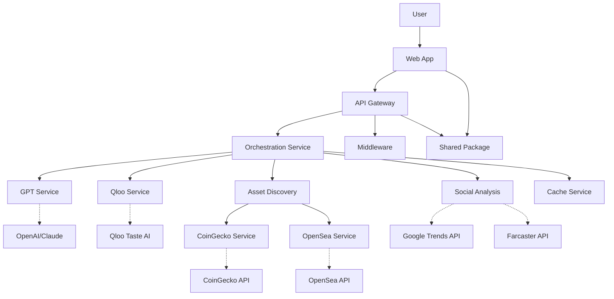

# Cultural Arbitrage Signal Engine - System Architecture

## Overview

The Cultural Arbitrage Signal Engine is a sophisticated web3 trend intelligence platform that maps emerging cultural "vibes" to crypto/NFT opportunities. The system leverages AI-powered cultural analysis, taste correlation algorithms, and multi-source asset discovery to provide actionable investment insights based on cultural trends.

**Tagline:** *Trade the trend before it trends — with taste-powered alpha.*

## High-Level System Architecture



## Architecture Layers

### 1. Frontend Layer

**Technologies:** Next.js, React, TypeScript, TailwindCSS, shadcn/ui

- **Web Application**: Modern React-based user interface featuring:
  - Dark-themed UI with shadcn/ui components built on Radix primitives
  - Interactive taste graphs using D3/visx for network visualization  
  - Real-time search capabilities with progressive result loading
  - Responsive design optimized for cultural trend exploration
  - Portfolio simulation interface with risk assessment tools

- **Shared Package**: Common TypeScript definitions including:
  - API request/response types and interfaces
  - Shared utility functions and validation schemas
  - Constants and configuration values
  - Date formatting and data transformation utilities

### 2. API Gateway Layer

**Technologies:** Node.js, Express.js, TypeScript

- **REST API Gateway**: Centralized entry point with structured endpoints:
  - `/api/expand` - Theme expansion and cultural analysis
  - `/api/taste` - Qloo taste correlations and recommendations  
  - `/api/assets` - Multi-source asset discovery and analysis
  - `/api/search` - Complete pipeline orchestration
  - `/api/simulate` - Portfolio simulation and backtesting

- **Middleware Stack**: Comprehensive request processing including:
  - Rate limiting with configurable quotas
  - CORS protection for secure cross-origin requests
  - Request/response logging for observability
  - Error handling with structured error responses
  - Input validation and sanitization

### 3. Core Services Layer

**Technologies:** Node.js, TypeScript, Async/Await Patterns

#### Orchestration Service

- **Purpose**: Central coordinator for the complete cultural arbitrage pipeline
- **Key Features**:
  - Parallel processing of multiple data sources
  - Intelligent caching with TTL management
  - Error handling with graceful fallbacks
  - Results aggregation and scoring algorithms
  - Performance metrics and timing analysis

#### GPT Service  

- **Purpose**: AI-powered theme expansion and content generation
- **Capabilities**:
  - Cultural theme expansion into related keywords and entities
  - Context-aware analysis of cultural movements
  - Asset opportunity summaries with explanatory rationale
  - Risk assessment and market timing insights

#### Qloo Service

- **Purpose**: Cultural taste correlation and demographic analysis
- **Features**:
  - Cross-domain entity correlations (music, art, brands, etc.)
  - Demographic profiling and behavioral insights
  - Cultural affinity mapping and trend prediction
  - Taste graph generation for visualization

#### Asset Discovery Services

**CoinGecko Service:**

- Token search and market data retrieval  
- Price analytics and market cap information
- Volume analysis and liquidity scoring
- Historical performance tracking

**OpenSea Service:**

- NFT collection discovery and metadata
- Floor price tracking and trading volume analysis
- Collection verification status and community metrics
- Marketplace activity and trend identification

#### Social Service

- **Purpose**: Multi-platform social media and trends analysis
- **Platforms**: Google Trends, Farcaster
- **Capabilities**:
  - Real-time search trend tracking and interest analysis
  - Cultural momentum assessment with confidence scoring
  - Viral potential assessment and trending identification
  - Community resonance and influence mapping

### 4. External Integration Layer

#### AI & Cultural Intelligence

- **Qloo Taste AI**: Provides sophisticated cultural correlation algorithms and cross-domain taste mapping
- **OpenAI/Claude**: Powers natural language understanding, theme expansion, and content generation

#### Market Data Sources  

- **CoinGecko API**: Comprehensive cryptocurrency market data, pricing, and analytics
- **OpenSea API**: NFT marketplace data, collection information, and trading metrics

#### Social Intelligence

- **Google Trends API**: Search trend analysis, cultural momentum, and interest metrics (free, no authentication required)
- **Farcaster API**: Decentralized social network data and community insights

### 5. Infrastructure Layer

#### Caching Strategy

- **In-Memory Cache**: Fast access to frequently requested data
- **TTL Management**: Configurable expiration for different data types
- **Cache Invalidation**: Smart refresh strategies for time-sensitive data

#### Performance Optimization

- **Parallel Processing**: Concurrent API calls for improved response times
- **Request Batching**: Efficient external API usage
- **Response Compression**: Optimized data transfer

## Data Processing Pipeline

### Core User Flow

1. **Input Processing**: User submits cultural "vibe" through intuitive search interface
2. **Theme Expansion**: LLM analyzes and expands the vibe into related keywords, entities, and cultural contexts
3. **Taste Correlation**: Qloo AI maps expanded themes to correlated cultural entities across multiple domains
4. **Parallel Asset Discovery**: Simultaneous queries to CoinGecko and OpenSea for relevant tokens and NFTs
5. **Social Analysis**: Real-time trend analysis across Google Trends and Farcaster platforms
6. **Results Aggregation**: Orchestration service combines all data sources, applies relevance scoring, and generates actionable insights
7. **Visualization**: Frontend renders interactive taste graphs, signal cards, and optional portfolio simulations

### Data Flow Sequence

```
User Input (vibe) → Theme Expansion (LLM) → Taste Correlations (Qloo) →
Asset Discovery (CoinGecko + OpenSea + Social) → Results Aggregation →
Scoring & Ranking → Interactive Visualization → User Insights
```

### Processing Timeline

- **Target Response Time**: 2-8 seconds for complete pipeline
- **Theme Expansion**: 1-2 seconds
- **Taste Correlation**: 1-2 seconds  
- **Asset Discovery**: 2-4 seconds (parallel processing)
- **Results Aggregation**: 1 second

## Key Features & Capabilities

### AI-Powered Analysis

- **Cultural Theme Expansion**: Transform simple vibes into comprehensive cultural landscapes
- **Cross-Domain Correlation**: Map cultural entities across music, art, fashion, and technology
- **Predictive Insights**: Identify emerging trends before they become mainstream

### Multi-Source Asset Discovery

- **Token Analysis**: Real-time cryptocurrency market data and trend identification
- **NFT Collection Insights**: Floor price tracking, volume analysis, and community metrics
- **Social Sentiment Integration**: Combine market data with social media intelligence

### Interactive Visualization

- **Taste Graph Networks**: D3-powered visualization of cultural correlations and asset relationships
- **Signal Cards**: Detailed asset recommendations with rationale and risk assessment
- **Portfolio Simulation**: What-if analysis with historical backtesting capabilities

### Risk Management

- **Confidence Scoring**: AI-generated confidence levels for all recommendations
- **Risk Assessment**: Multi-dimensional risk evaluation including market, liquidity, and social factors
- **Diversification Guidance**: Portfolio construction recommendations based on cultural thesis

## Technical Specifications

### Technology Stack

- **Frontend**: Next.js 14, React 18, TypeScript, TailwindCSS, shadcn/ui
- **Backend**: Node.js 18+, Express.js, TypeScript
- **Visualization**: D3.js, visx, react-force-graph
- **Build System**: Turborepo for monorepo management
- **Package Management**: npm workspaces

### API Standards

- **REST Architecture**: RESTful endpoints with consistent response formats
- **Error Handling**: Structured error responses with proper HTTP status codes
- **Rate Limiting**: Configurable quotas to manage external API costs
- **Caching**: Intelligent caching strategies for performance optimization

### Security & Reliability

- **API Key Management**: Server-side key storage with no client-side exposure
- **CORS Protection**: Secure cross-origin request handling
- **Graceful Degradation**: Partial results when individual services fail
- **Retry Logic**: Intelligent retry strategies for transient failures

## Deployment Architecture

### Current Setup

- **Frontend**: Vercel deployment with automatic CI/CD
- **Backend**: Railway/Render deployment with Docker containers
- **Monitoring**: Basic request logging and error tracking

### Scalability Considerations

- **Horizontal Scaling**: Stateless service design enables easy scaling
- **Caching Layer**: Redis integration planned for production scaling
- **Load Balancing**: Multiple backend instances for high availability
- **CDN Integration**: Asset delivery optimization

## Development Workflow

### Repository Structure

```
cultural-arbitrage/
├── apps/
│   ├── web/                 # Next.js frontend application
│   └── api/                 # Node.js backend API
├── packages/
│   └── shared/              # Shared types and utilities
├── docs/                    # Documentation and specifications
└── .github/workflows/       # CI/CD pipeline configuration
```

### Environment Management

- **Development**: Local development with API mocking capabilities
- **Staging**: Full integration testing with real APIs
- **Production**: Optimized deployment with monitoring and analytics

---

**Generated on:** `2025-01-05T19:47:00Z`  
**Version:** `1.0.0`  
**Project:** Cultural Arbitrage Signal Engine  
**Team:** Anything.ai
